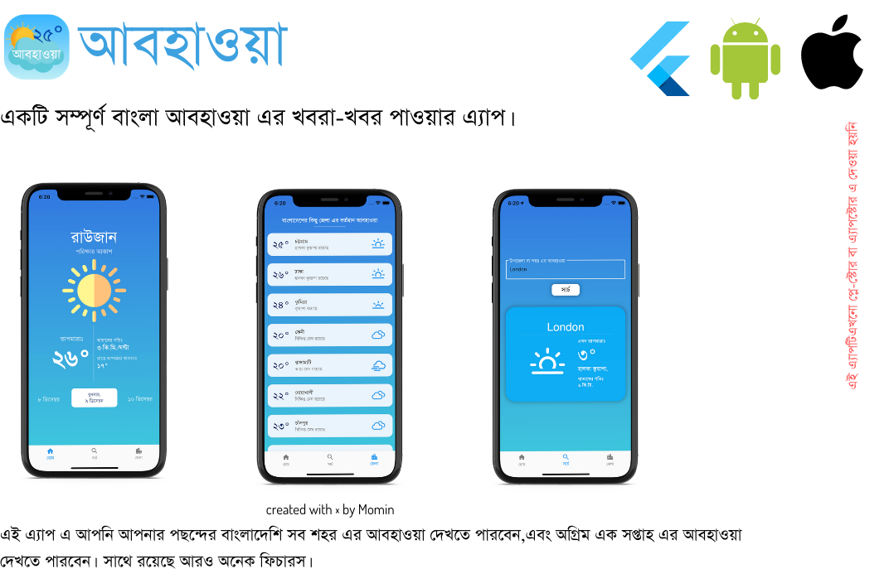
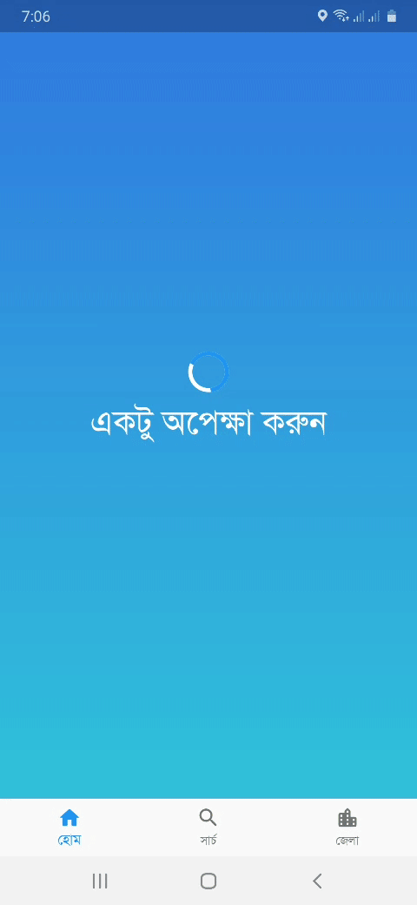
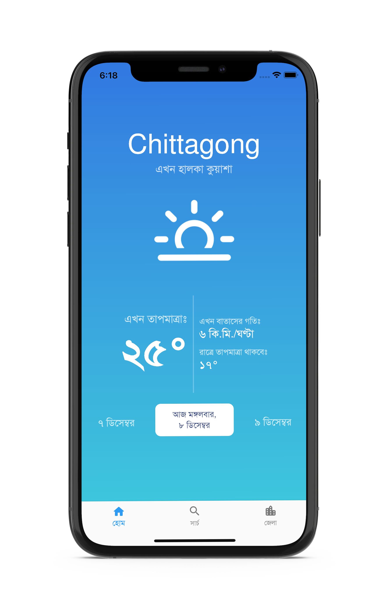
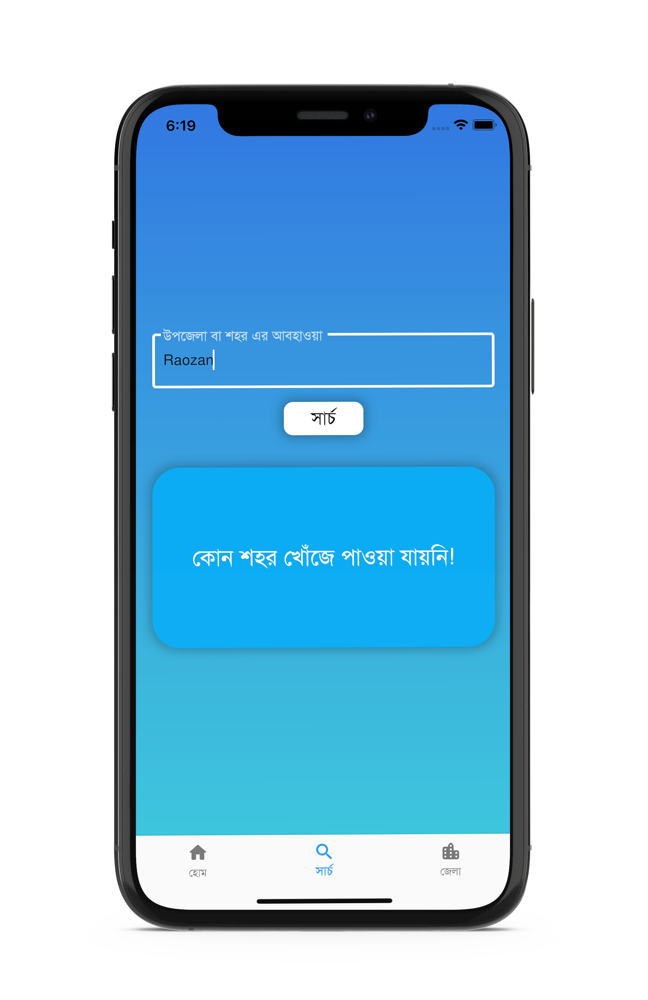
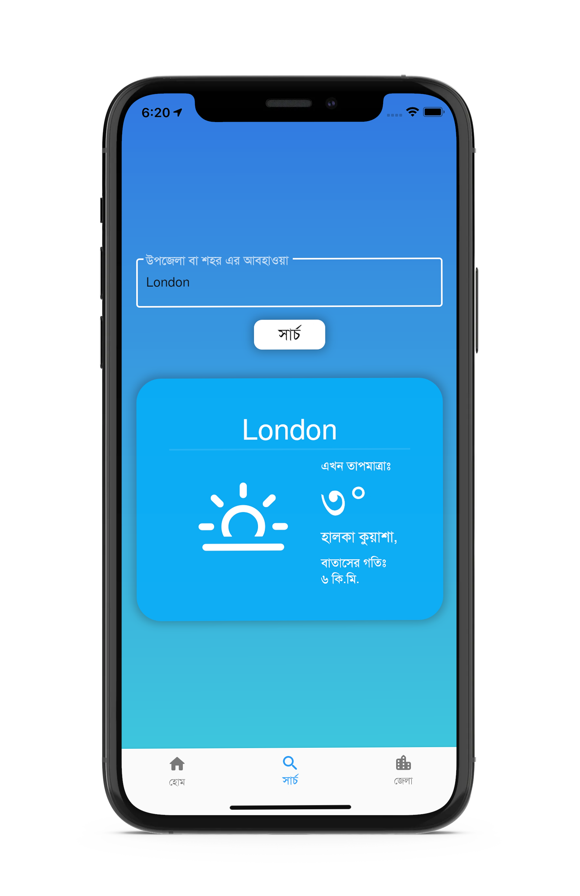
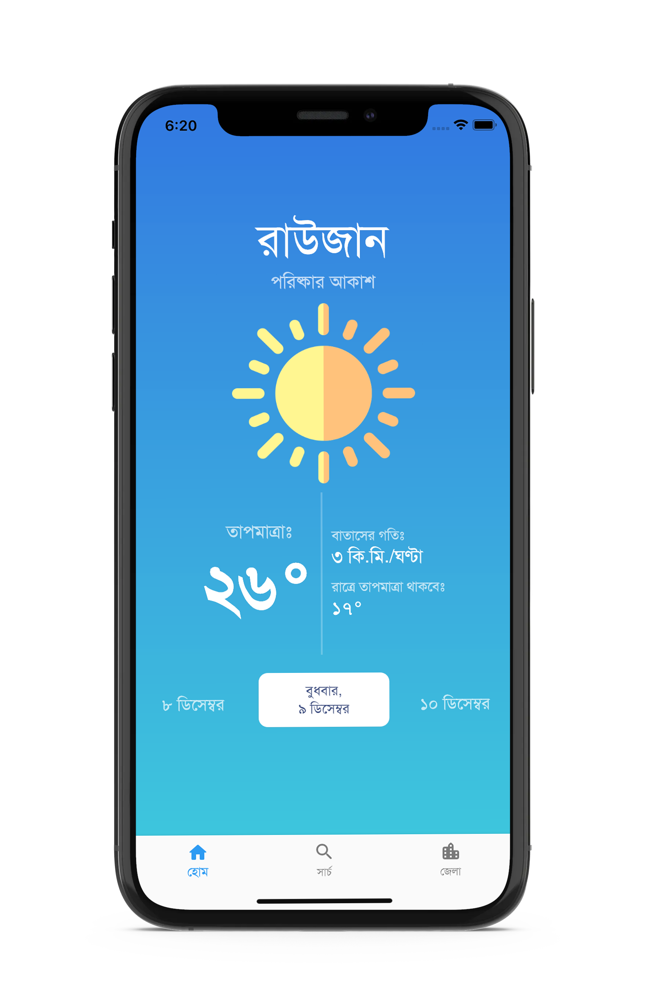
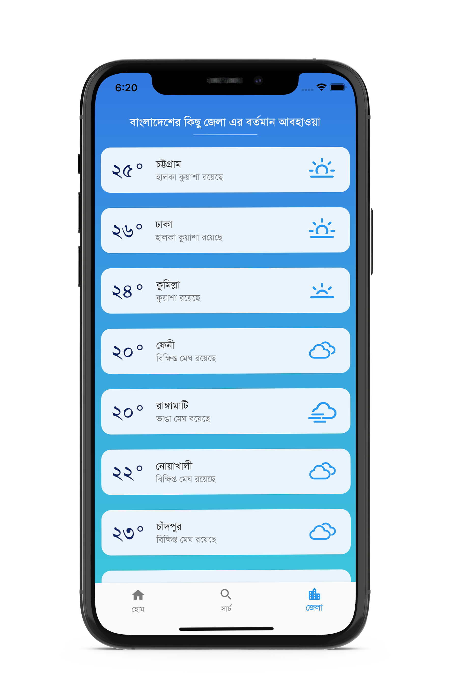

###   
 
এটি একটি বাংলা আবহাওয়া এর এ্যাপ। আপনি চাইলে এই এ্যাপ ব্যবহার করতে পারবেন। Flutter ইউজ করে এই এ্যাপ বানানো হয়েছে। API ইউজ করা হয়েছে OPEN WEATHER ফ্রি এপিআই।
 
 

## API KEY এড করতে হবে এখানেঃ
***lib/controller/services/connection/getWeather.dart***
>এই ফাইল এ API Key Variable এ আপনার Open Weather Api key এড করলেই হবে। আপনি চাইলে জেলা এর আবহাওয়া ফেচিং এর জন্য আলাদা API ইউজ করতে পারবেন।

## Features

- সম্পূর্ণ বাংলায় একটি এ্যাপ
- অগ্রিম ৬ দিন এর আবহাওয়া সম্পর্কে যানা যাবে
- আজকের আবহাওয়া সম্পর্কে জানা যাবে
- রাত্রের আবহাওয়া সম্পর্কে জানা যাবে
- গতকাল এর আবহাওয়া ও জানা যাবে
- সার্চ করে যেখনো শহর এর আবহাওয়া জানে যাবে
- বাংলাদেশের সব জেলা এর আবহাওয়া এক সাথে

 
 

- ### অনেক সময় আইফোনে বাংলা লোকেশন এর নাম আসে না তখন তার পরিবর্তে ইংরেজি আসবে ব্যাকআপ হিসেবে 

- ### আপাতত শুধু ইংরেজি সার্চ সাপোর্টেড
> অনেক শহরের নাম ইংরেজি স্পেলিং ভুল হলে আসবে না, যেমন এখানে "Raojan" লিখলে আসবে কিন্তু "Raozan" লিখলে আসবে না

- ### বাইরের দেশের শহরের নাম গুলা ইংরেজিতেই আসবে

- ### গতকালের আবহাওয়া তে রাত্রের ডাটা দেখাবে না 😔
> কারণ Open Weather Api তে এই ডাটা পাওয়া যায় না

- ### আর আকাশ পরিষ্কার থাকলে সূর্য হলুদ হয়ে যাবে 😁

- ### ফ্রি এপি আই !
> লিমিটেশন এর কারণে একসাথে ৬৪ জেলার আবহাওয়া ফেচ করতে পারতেছি না, পরে এই ফিচার টা এড করা যেতে পারে, ক্যাচিং করে। 

- ### ফন্ট ব্যবহার করা হয়েছেঃ [**সোলাইমান লিপি**](https://www.omicronlab.com/bangla-fonts.html)
- ### [এই এ্যাপ অনুপ্রাণিত এই Dribble ডিজাইন থেকে](https://dribbble.com/shots/14180517-Weatherly-app)
- ### Icon Credit
    >The icon designs are originally by [Lukas Bischoff](http://www.twitter.com/artill). Icon art for v1.1 forward, HTML, Less, and CSS are by [Erik](http://www.helloerik.com).
-

## Github এ কেন এই এ্যাপ এর সোর্স কোড এড করলাম?

>কারণ আমি চাই সবাই এটাতে কন্ট্রিবিউট করুক। ব্যক্তিগত ভাবে আমি এই এপ এর প্রয়োজনীয়তা অনুভব করেছিলাম। কারণ, প্লে-স্টোর এ যা আবহাওয়া এ্যাপ রয়েছে  তা সম্পুর্ণ বাংলা নয়। আর আপাতত প্লে-স্টোর এ দেওয়ার ইচ্ছা নাই।
